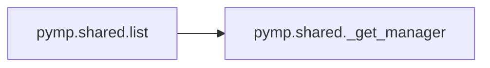
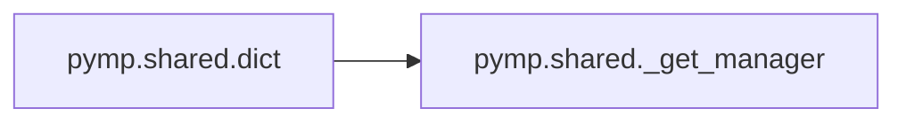
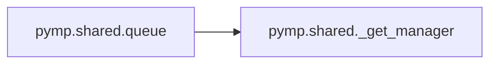

# Pymp Shared

[_Documentation generated by Documatic_](https://www.documatic.com)

<!---Documatic-section-Codebase Structure-start--->
## Codebase Structure

<!---Documatic-block-system_architecture-start--->
```mermaid
None
```
<!---Documatic-block-system_architecture-end--->

# #
<!---Documatic-section-Codebase Structure-end--->

<!---Documatic-section-pymp.shared._get_manager-start--->
## [pymp.shared._get_manager](3-pymp_shared.md#pymp.shared._get_manager)

<!---Documatic-section-_get_manager-start--->
<!---Documatic-block-pymp.shared._get_manager-start--->
<details>
	<summary><code>pymp.shared._get_manager</code> code snippet</summary>

```python
def _get_manager():
    global _MANAGER, _LOCK
    if _MANAGER is None:
        with _LOCK:
            if _MANAGER is None:
                try:
                    _MANAGER = _multiprocessing.Manager()
                except RuntimeError as err:
                    _LOGGER.error("Could not create a multiprocessing manager. This is likely because you are calling a function using PyMP directly from the main script, without guarding it with a `if __name__ == '__main__':`. This is not supported. Just in case, we'll raise the original exception.")
                    raise err
    return _MANAGER
```
</details>
<!---Documatic-block-pymp.shared._get_manager-end--->
<!---Documatic-section-_get_manager-end--->

# #
<!---Documatic-section-pymp.shared._get_manager-end--->

<!---Documatic-section-pymp.shared.array-start--->
## [pymp.shared.array](3-pymp_shared.md#pymp.shared.array)

<!---Documatic-section-array-start--->
<!---Documatic-block-pymp.shared.array-start--->
<details>
	<summary><code>pymp.shared.array</code> code snippet</summary>

```python
def array(shape, dtype=None, autolock=False):
    assert _NP_AVAILABLE, 'To use the shared array object, numpy must be available!'
    if dtype is None:
        dtype = _np.float64
    if not isinstance(dtype, _np.dtype):
        dtype = _np.dtype(dtype)
    shared_arr = _multiprocessing.Array('b', int(_np.prod(shape) * dtype.itemsize), lock=autolock)
    with _warnings.catch_warnings():
        _warnings.simplefilter('ignore', RuntimeWarning)
        data = _np.ctypeslib.as_array(shared_arr).view(dtype).reshape(shape)
    return data
```
</details>
<!---Documatic-block-pymp.shared.array-end--->
<!---Documatic-section-array-end--->

# #
<!---Documatic-section-pymp.shared.array-end--->

<!---Documatic-section-pymp.shared.list-start--->
## [pymp.shared.list](3-pymp_shared.md#pymp.shared.list)

<!---Documatic-section-list-start--->


### Object Calls

* [pymp.shared._get_manager](3-pymp_shared.md#pymp.shared._get_manager)

<!---Documatic-block-pymp.shared.list-start--->
<details>
	<summary><code>pymp.shared.list</code> code snippet</summary>

```python
def list(*args, **kwargs):
    return _get_manager().list(*args, **kwargs)
```
</details>
<!---Documatic-block-pymp.shared.list-end--->
<!---Documatic-section-list-end--->

# #
<!---Documatic-section-pymp.shared.list-end--->

<!---Documatic-section-pymp.shared.dict-start--->
## [pymp.shared.dict](3-pymp_shared.md#pymp.shared.dict)

<!---Documatic-section-dict-start--->


### Object Calls

* [pymp.shared._get_manager](3-pymp_shared.md#pymp.shared._get_manager)

<!---Documatic-block-pymp.shared.dict-start--->
<details>
	<summary><code>pymp.shared.dict</code> code snippet</summary>

```python
def dict(*args, **kwargs):
    return _get_manager().dict(*args, **kwargs)
```
</details>
<!---Documatic-block-pymp.shared.dict-end--->
<!---Documatic-section-dict-end--->

# #
<!---Documatic-section-pymp.shared.dict-end--->

<!---Documatic-section-pymp.shared.queue-start--->
## [pymp.shared.queue](3-pymp_shared.md#pymp.shared.queue)

<!---Documatic-section-queue-start--->


### Object Calls

* [pymp.shared._get_manager](3-pymp_shared.md#pymp.shared._get_manager)

<!---Documatic-block-pymp.shared.queue-start--->
<details>
	<summary><code>pymp.shared.queue</code> code snippet</summary>

```python
def queue(*args, **kwargs):
    return _get_manager().Queue(*args, **kwargs)
```
</details>
<!---Documatic-block-pymp.shared.queue-end--->
<!---Documatic-section-queue-end--->

# #
<!---Documatic-section-pymp.shared.queue-end--->

[_Documentation generated by Documatic_](https://www.documatic.com)